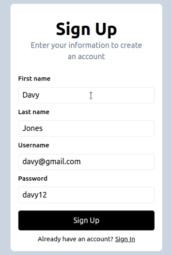
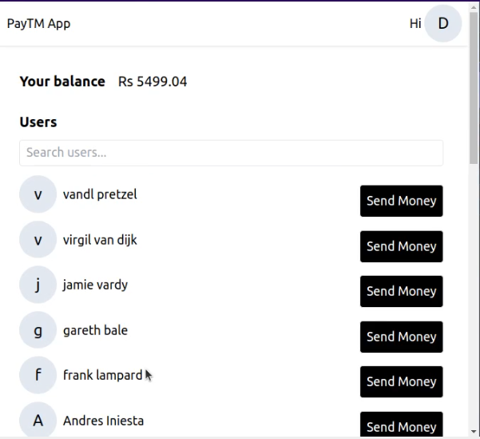
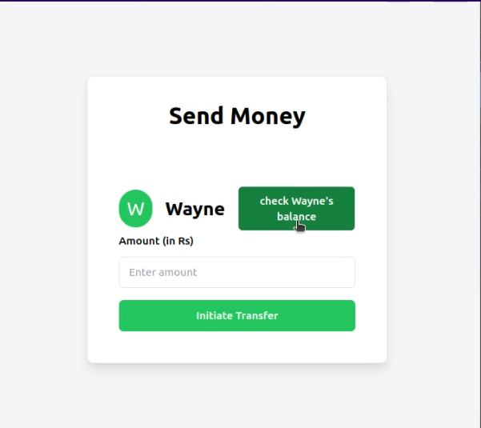
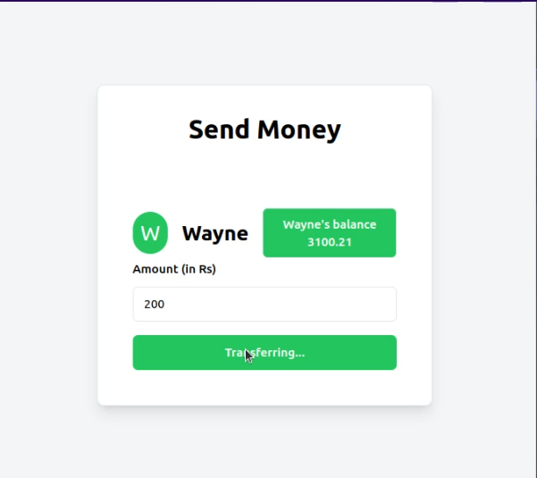
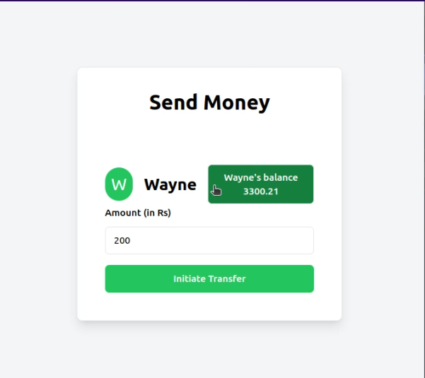

<p align="center">
    
</p>
<p align="center"><h1 align="center">PAYTMDEMO</h1></p>

<p align="center">
	
	
	
</p>

 





##  Project Structure

```sh
└── paytmDemo/
    ├── Dockerfile
    ├── README.md
    ├── backend
    │   ├── .gitignore
    │   ├── config.js
    │   ├── db.js
    │   ├── index.js
    │   ├── middleware.js
    │   ├── package-lock.json
    │   ├── package.json
    │   └── routes
    └── frontend
        ├── .eslintrc.cjs
        ├── .gitignore
        ├── README.md
        ├── index.html
        ├── package-lock.json
        ├── package.json
        ├── postcss.config.js
        ├── public
        ├── src
        ├── tailwind.config.js
        └── vite.config.js
```
##  Getting Started

###  Prerequisites

Before getting started with paytmDemo, ensure your runtime environment meets the following requirements:

- **Programming Language:** JavaScript
- **Package Manager:** Npm


###  Installation

Install paytmDemo using one of the following methods:

**Build from source:**

1. Clone the paytmDemo repository:
```sh
❯ git clone https://github.com/itsFZA/paytmDemo
```

2. Navigate to the project directory:
```sh
❯ cd paytmDemo
```

3. Install the project dependencies:


**Using `npm`** &nbsp; [](https://www.npmjs.com/)

```sh
❯ npm install
```
3. Create a file ".env" inside backend folder and add two environment variables
-   DATABASE_URL (mongodb url connection string)
-   JWT_SECRET (a string or a key)


###  Usage
Run paytmDemo using the following command:
**Using `npm`** &nbsp; [](https://www.npmjs.com/)

- Inside backend folder run
```sh
❯ npm run dev
```

- Open a new terminal and inside frontend folder run
```sh
❯ npm run dev
```

- Frontend should be available at
```sh
❯ localhost:5173
```
- Backend should be available at
```sh
❯ localhost:3000
```

---

##  Acknowledgments

- 100xdevs

---